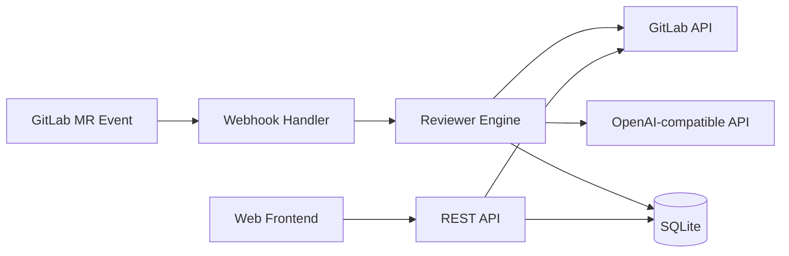

# 🚀 GitReviewAI

> **AI-powered code review for GitLab Merge Requests**
>
> Line-level comments • MR summary reports • Self-hosted • OpenAI-compatible

[](LICENSE)
[](https://go.dev/)
[](https://www.docker.com/)

[中文文档](README_CN.md) · [🚀 Quick Start](#-quick-start-in-30-seconds) · [📺 Demo](#-demo)

---

## ⚠️ Stop Reviewing Merge Requests Manually

Let AI handle your code reviews 👇

- ✅ Automatically analyze GitLab MRs, comment on every line
- ✅ Generate structured review reports, write back to GitLab
- ✅ Self-hosted — your data stays with you
- ✅ Works with any OpenAI-compatible API (OpenAI / DeepSeek / Ollama / vLLM, etc.)

---

## 📺 Demo

### 🔄 How It Works

```
GitLab MR Created → Webhook Triggered → GitReviewAI Analyzes → AI Line Comments + MR Summary → Written Back to GitLab
```

### 💬 Line Comments & Review Reports

<table>
  <tr>
    <td align="center"><b>Line Comments (GitReviewAI Dashboard)</b></td>
    <td align="center"><b>Line Comments (GitLab)</b></td>
  </tr>
  <tr>
    <td></td>
    <td></td>
  </tr>
  <tr>
    <td align="center"><b>Review Report (GitReviewAI Dashboard)</b></td>
    <td align="center"><b>Review Report (GitLab)</b></td>
  </tr>
  <tr>
    <td></td>
    <td></td>
  </tr>
</table>

### 🔍 Review Example

**Input code:**

```go
func getUser(user *User) string {
    return user.Name
}
```

**AI review result:**

🔴 **Potential nil pointer dereference** — Runtime panic if `user == nil`.

💡 **Suggested fix:**

```go
if user == nil {
    return ""
}
```

---

## 🧠 Why GitReviewAI?

| Feature | GitReviewAI | SaaS Tools (GitLab Duo / CodeRabbit, etc.) |
|---|---|---|
| 🏠 Self-hosted | ✅ | ❌ |
| 💬 Line-level comments | ✅ | ⚠️ Partial |
| 🔌 OpenAI-compatible (multi-model) | ✅ | ❌ |
| 🔒 Full data control | ✅ | ❌ |
| 🔧 Custom review rules | ✅ | ❌ |
| 📊 Web dashboard | ✅ | ⚠️ Limited |
| 💰 Free & open source | ✅ MIT | ❌ Per-user pricing |

---

## ✨ Features

| Feature | Description |
|---|---|
| 🤖 AI Code Review | Any OpenAI-compatible API (OpenAI / DeepSeek / Ollama / vLLM, etc.) |
| 💬 Line-level Comments | Pinpoint issues on exact code lines, written back to GitLab MR |
| 📄 Summary Reports | Structured review reports (error / warning / suggestion levels) |
| 🧠 Custom Rules | Built-in rules + custom rules + project-level overrides |
| 🛡 Dual Mode | Manual review mode (approve before posting) / Auto-submit mode |
| ⚡ Batch Processing | Auto-split large diffs to stay within model context limits |
| 📊 History | SQLite persistence, review history & statistics |
| 🌐 Web Dashboard | Vue 3 admin panel with JWT authentication |

---

## ⚡ Quick Start in 30 Seconds

### Option 1: Docker (Recommended)

```bash
# 1. Prepare config
cp config.yaml.example config.yaml
vi config.yaml  # Fill in your settings

# 2. Start
docker run -d \
  --name gitreviewai \
  -p 8080:8080 \
  -v $(pwd)/config.yaml:/app/config.yaml \
  -v $(pwd)/data:/app/data \
  gitreviewai server
```

### Option 2: Pre-built Binary

Download from [GitHub Releases](https://github.com/yuhua2000/GitReviewAI/releases):

| Platform | Filename |
|---|---|
| Linux x86_64 | `gitreviewai-linux-amd64` |
| Linux ARM64 | `gitreviewai-linux-arm64` |
| macOS Intel | `gitreviewai-darwin-amd64` |
| macOS Apple Silicon | `gitreviewai-darwin-arm64` |
| Windows x86_64 | `gitreviewai-windows-amd64.exe` |
| Windows ARM64 | `gitreviewai-windows-arm64.exe` |

```bash
wget https://github.com/yuhua2000/GitReviewAI/releases/latest/download/gitreviewai-linux-amd64
chmod +x gitreviewai-linux-amd64
cp config.yaml.example config.yaml && vi config.yaml
./gitreviewai-linux-amd64 server
```

### Option 3: Build from Source

```bash
git clone https://github.com/yuhua2000/GitReviewAI.git
cd GitReviewAI
cp config.yaml.example config.yaml && vi config.yaml
make build
./gitreviewai server
```

---

## 🔧 Configuration

Key parameters in `config.yaml`:

```yaml
# GitLab
gitlab_url: "https://gitlab.com"              # Change for self-hosted GitLab
gitlab_token: "glpat-xxxxxxxxx"                # Requires api scope

# AI Model (OpenAI-compatible)
openai_api_key: "sk-xxxxxxxxx"
openai_model: "gpt-4o"
openai_base_url: "https://api.openai.com/v1"  # Replace with any compatible gateway

# Server
port: 8080
webhook_token: "your-webhook-secret"           # Optional, skip validation if empty

# Web Dashboard
password: "your-login-password"                # Required
jwt_secret: "your-jwt-secret-at-least-32-chars"  # Required
```

> See [`config.yaml.example`](config.yaml.example) for the full configuration reference.

---

## 🔗 GitLab Webhook Setup

1. Go to GitLab project → **Settings** → **Webhooks**
2. URL: `http://your-server:8080/webhook`
3. Check ✅ **Merge requests events**
4. Click **Add webhook** — done 🎉

> Health check available at `GET /health`, returns `200 OK` when the service is running.

---

## 🏗 Architecture



---

## 🧭 Roadmap

- [x] GitLab Webhook integration
- [x] AI line-level comments
- [x] MR summary reports
- [x] Web dashboard (Vue 3)
- [x] SQLite data persistence
- [x] JWT authentication
- [x] Manual review / auto-submit dual mode
- [x] Custom review rules (built-in + custom + project-level overrides)
- [x] Multi-model support (project-level binding + global default)
- [ ] GitHub PR support
- [ ] Auto-fix code suggestions
- [ ] VSCode extension

---

## 🤝 Contributing

PRs welcome! Please:

- Use `go fmt` for formatting
- Add tests for new features
- Keep changes clear and maintainable

---

## 🙌 Acknowledgements

This project is supported by the **Xiaomi MiMo Token Program** with API token credits. Special thanks!

---

## 📄 License

MIT License © GitReviewAI
