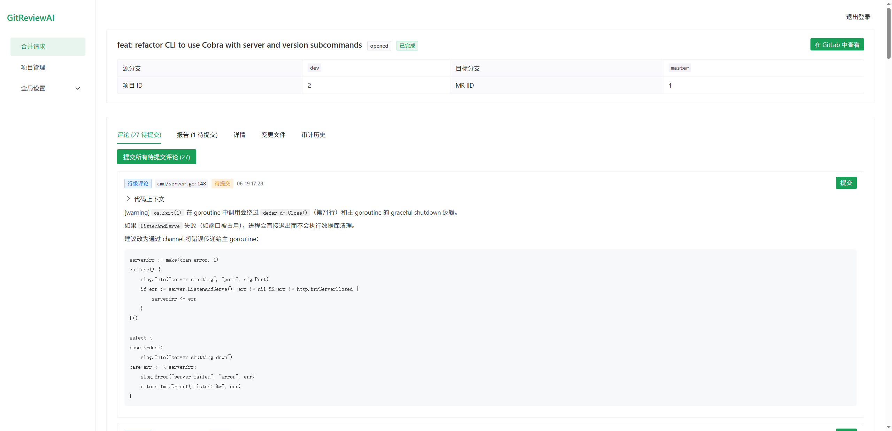
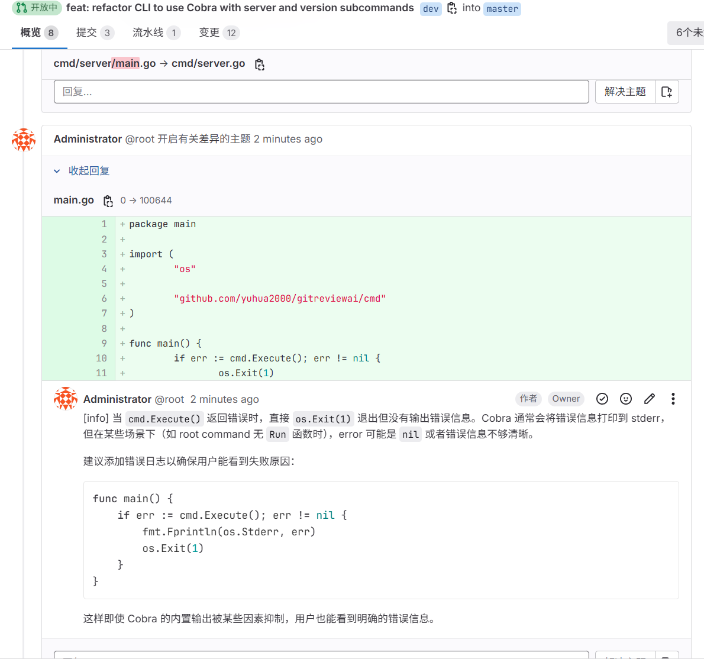
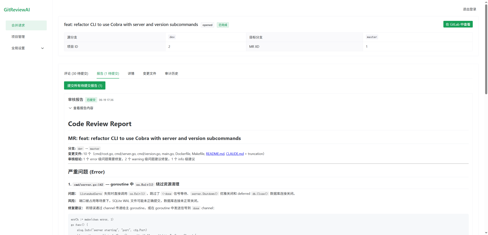
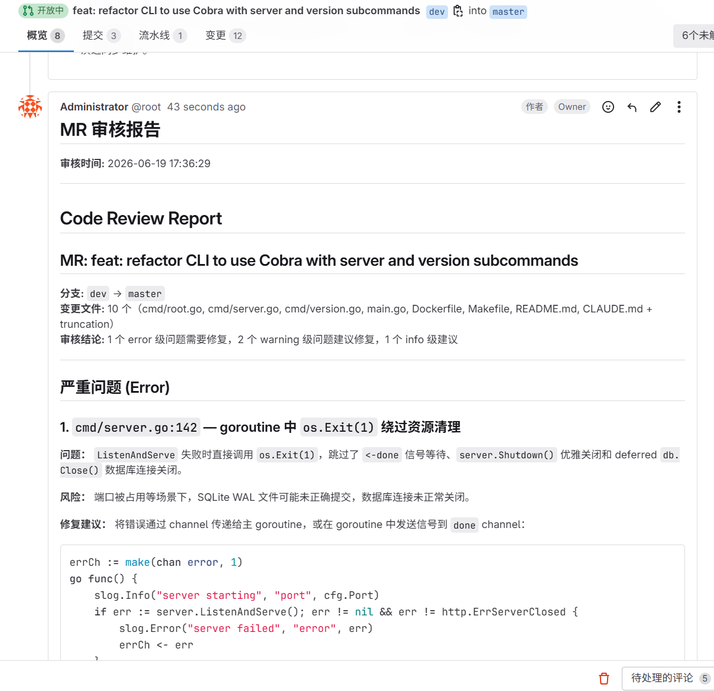
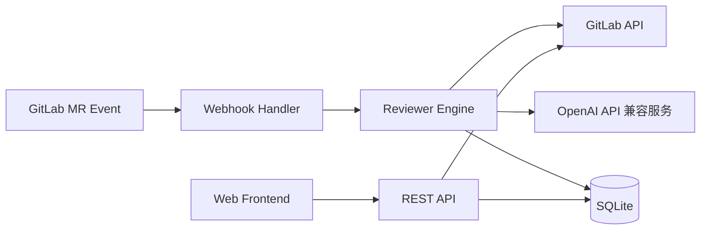

# 🚀 GitReviewAI

> **AI 驱动的 GitLab Merge Request 自动代码审查工具**
>
> 行级代码评论 • MR 自动总结 • 自托管 • OpenAI 兼容

[](LICENSE)
[](https://go.dev/)
[](https://www.docker.com/)

[English](README.md) · [🚀 快速开始](#-30-秒快速开始) · [📺 效果展示](#-效果展示)

---

## 还在手动 Review Merge Request？

让 AI 帮你完成代码审查 👇

- ✅ 自动分析 GitLab MR，逐行标注问题
- ✅ 生成结构化审查报告，写回 GitLab
- ✅ 自托管部署，数据完全可控
- ✅ 兼容任意 OpenAI API 接口的模型服务（OpenAI / DeepSeek / Ollama / vLLM 等）

---

## 📺 效果展示

### 工作流程

```
GitLab 创建 MR → Webhook 触发 → GitReviewAI 自动分析 → AI 行级评论 + MR 总结 → 写回 GitLab
```

### 行级评论 & 审查报告

<table>
  <tr>
    <td align="center"><b>行级评论（GitReviewAI 平台）</b></td>
    <td align="center"><b>行级评论（GitLab）</b></td>
  </tr>
  <tr>
    <td></td>
    <td></td>
  </tr>
  <tr>
    <td align="center"><b>审查报告（GitReviewAI 平台）</b></td>
    <td align="center"><b>审查报告（GitLab）</b></td>
  </tr>
  <tr>
    <td></td>
    <td></td>
  </tr>
</table>

### 实际审查示例

**输入代码：**

```go
func getUser(user *User) string {
    return user.Name
}
```

**AI 审查结果：**

🔴 **潜在空指针风险** — 如果 `user == nil`，此处会发生运行时 panic。

💡 **建议修复：**

```go
if user == nil {
    return ""
}
```

---

## 🧠 为什么选择 GitReviewAI？

| 功能 | GitReviewAI | SaaS 工具（GitLab Duo / CodeRabbit 等） |
|---|---|---|
| 🏠 自托管 | ✅ | ❌ |
| 💬 行级代码评论 | ✅ | ⚠️ 部分支持 |
| 🔌 OpenAI 兼容（多模型） | ✅ | ❌ |
| 🔒 数据完全可控 | ✅ | ❌ |
| 🔧 自定义审查规则 | ✅ | ❌ |
| 📊 Web 管理界面 | ✅ | ⚠️ 受限 |
| 💰 免费开源 | ✅ MIT | ❌ 按人/月收费 |

---

## 核心功能

| 功能 | 说明 |
|---|---|
| 🤖 AI 代码审查 | 兼容任意 OpenAI API 接口的模型服务（OpenAI / DeepSeek / Ollama / vLLM 等） |
| 💬 行级评论 | 精准标注到代码行，直接写回 GitLab MR |
| 📄 自动总结报告 | 生成结构化审查报告（错误 / 警告 / 建议分级） |
| 🧠 自定义规则 | 内置规则 + 自定义规则 + 项目级覆盖 |
| 🛡 双模式 | 人工审核模式（先审后发）/ 自动提交模式 |
| ⚡ 批量处理 | 自动分批处理大 diff，避免超出模型上下文 |
| 📊 历史记录 | SQLite 持久化，支持审查历史查询与统计 |
| 🌐 Web 界面 | Vue 3 管理后台，JWT 认证 |

---

## ⚡ 30 秒快速开始

### 方式一：Docker 一键启动（推荐）

```bash
# 1. 准备配置文件
cp config.yaml.example config.yaml
vi config.yaml  # 填入必要配置

# 2. 启动服务
docker run -d \
  --name gitreviewai \
  -p 8080:8080 \
  -v $(pwd)/config.yaml:/app/config.yaml \
  -v $(pwd)/data:/app/data \
  gitreviewai server
```

### 方式二：下载预编译二进制

从 [GitHub Releases](https://github.com/yuhua2000/GitReviewAI/releases) 下载对应平台的二进制文件：

| 平台 | 文件名 |
|---|---|
| Linux x86_64 | `gitreviewai-linux-amd64` |
| Linux ARM64 | `gitreviewai-linux-arm64` |
| macOS Intel | `gitreviewai-darwin-amd64` |
| macOS Apple Silicon | `gitreviewai-darwin-arm64` |
| Windows x86_64 | `gitreviewai-windows-amd64.exe` |
| Windows ARM64 | `gitreviewai-windows-arm64.exe` |

```bash
wget https://github.com/yuhua2000/GitReviewAI/releases/latest/download/gitreviewai-linux-amd64
chmod +x gitreviewai-linux-amd64
cp config.yaml.example config.yaml && vi config.yaml
./gitreviewai-linux-amd64 server
```

### 方式三：从源码构建

```bash
git clone https://github.com/yuhua2000/GitReviewAI.git
cd GitReviewAI
cp config.yaml.example config.yaml && vi config.yaml
make build
./gitreviewai server
```

---

## 配置说明

`config.yaml` 关键参数：

```yaml
# GitLab
gitlab_url: "https://gitlab.com"              # 私有部署改为你的地址
gitlab_token: "glpat-xxxxxxxxx"                # 需具备 api 权限

# AI 模型（OpenAI 兼容）
openai_api_key: "sk-xxxxxxxxx"
openai_model: "gpt-4o"
openai_base_url: "https://api.openai.com/v1"  # 可替换为任意兼容网关

# 服务
port: 8080
webhook_token: "your-webhook-secret"           # GitLab Webhook 验证密钥（可选，不填则跳过验证）

# Web 管理界面
password: "your-login-password"                # 登录密码（必填）
jwt_secret: "your-jwt-secret-at-least-32-chars"  # JWT 签名密钥（必填）
```

> 完整配置请参考 [`config.yaml.example`](config.yaml.example)

---

## GitLab Webhook 配置

1. 进入 GitLab 项目 → **Settings** → **Webhooks**
2. URL 填写：`http://你的服务器:8080/webhook`
3. 勾选 ✅ **Merge requests events**
4. 点击 **Add webhook** 完成 🎉

> 服务启动后可通过 `GET /health` 检查服务状态，返回 `200 OK` 表示正常运行。

---

## 🏗 系统架构



---

## 🧭 Roadmap

- [x] GitLab Webhook 集成
- [x] AI 行级评论
- [x] MR 自动总结报告
- [x] Web 管理界面（Vue 3）
- [x] SQLite 数据持久化
- [x] JWT 认证
- [x] 人工审核 / 自动提交双模式
- [x] 自定义审查规则（内置 + 自定义 + 项目级覆盖）
- [x] 多模型支持（项目级绑定 + 全局默认）
- [ ] GitHub PR 支持
- [ ] 自动修复代码建议
- [ ] VSCode 插件

---

## 贡献

欢迎 PR！请确保：

- 使用 `go fmt` 格式化代码
- 新功能补充测试
- 保持变更清晰可维护

---

## 致谢

本项目开发得到了 **小米 MiMo Token 计划** 提供的 API Token 支持，特此感谢！

---

## License

MIT License © GitReviewAI
